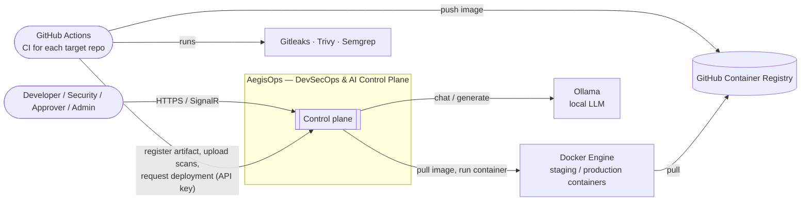
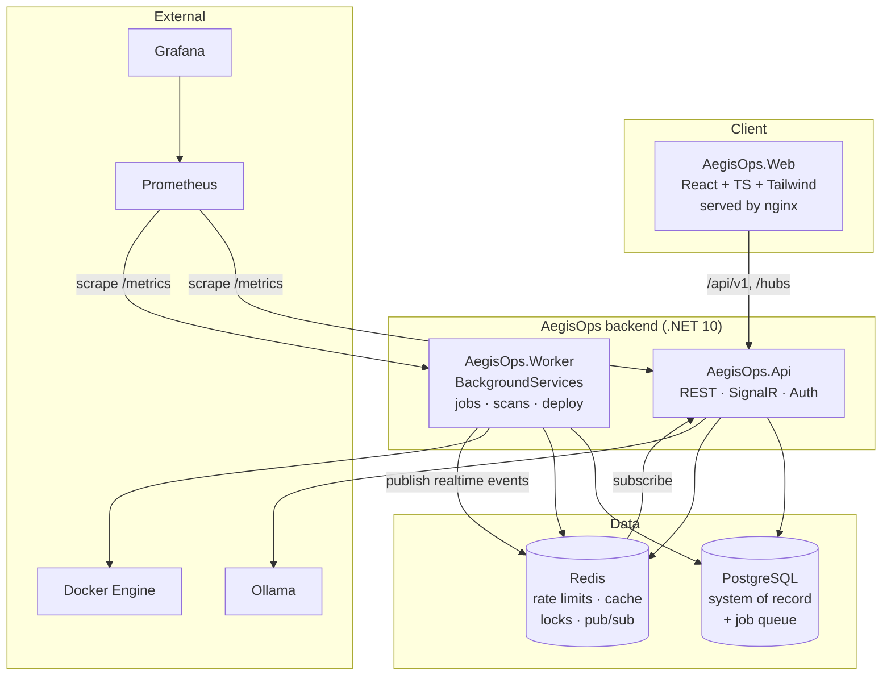
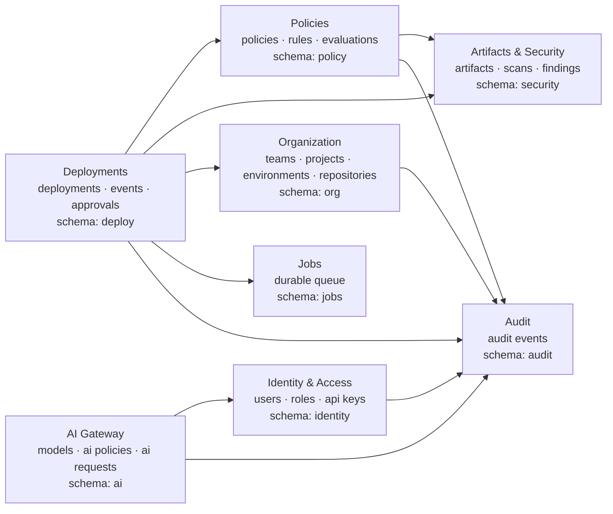
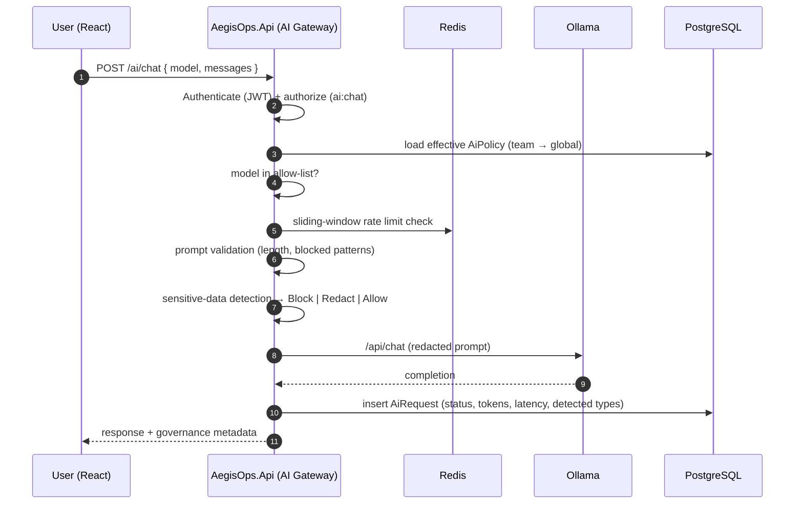

# 02 — Architecture

## 1. Architectural style

| Aspect | Decision | Reference |
| --- | --- | --- |
| Overall | **Modular monolith** — one deployable API, one Worker, clear module boundaries | [ADR-0002](adr/0002-modular-monolith.md) |
| Internal structure | **Clean Architecture** — Domain ← Application ← Infrastructure/Api/Worker | [ADR-0001](adr/0001-aspnet-core-clean-architecture.md) |
| Process model | 3 processes: `Api`, `Worker`, `Web` (static React served by nginx) | this document §4 |
| Persistence | PostgreSQL as system of record; Redis for ephemeral/high-frequency state | [ADR-0003](adr/0003-postgresql-source-of-truth.md), [ADR-0004](adr/0004-redis-for-ephemeral-state.md) |
| Async work | Durable job table in PostgreSQL + `BackgroundService` in Worker | [ADR-0005](adr/0005-durable-job-queue-in-postgresql.md) |
| Real-time | SignalR hub in Api, Worker publishes through a small in-process/Redis bridge | §6.3 |
| AI | AegisOps is an **AI gateway** in front of Ollama | [ADR-0006](adr/0006-ollama-local-llm.md) |
| CI/CD | GitHub Actions does the work; AegisOps is the control plane | [ADR-0007](adr/0007-github-actions-ci-aegisops-control-plane.md) |

## 2. System context (C4 level 1)



## 3. Container view (C4 level 2)



### Responsibilities

| Container | Responsibilities | Never does |
| --- | --- | --- |
| **AegisOps.Api** | HTTP API, authentication/authorization, validation, synchronous reads/writes, SignalR hub, AI gateway request path, enqueueing jobs | Long-running work (scans, deployments) |
| **AegisOps.Worker** | Polls job queue; evaluates policies; runs scanners (v2); executes deployments via Docker; parses reports; emits timeline events | Serve HTTP to users (only exposes `/health` and `/metrics`) |
| **AegisOps.Web** | UI, client-side routing, TanStack Query cache, SignalR subscriptions | Business logic; decisions always come from the API |
| **PostgreSQL** | All durable state incl. `jobs` table, audit log | — |
| **Redis** | AI rate-limit counters, idempotency keys, short-lived caches, distributed locks, pub/sub bridge Worker → Api for SignalR | Anything that must survive a flush |

## 4. Solution layout and dependency rule

```
AegisOps.Domain          ← entities, value objects, enums, domain events, policy rule logic
      ▲
AegisOps.Application     ← use cases (application services), interfaces (ports), DTOs, validators
      ▲
AegisOps.Infrastructure  ← EF Core, Redis, Ollama client, Docker client, SARIF parsers, Identity
      ▲                ▲
AegisOps.Api     AegisOps.Worker   ← composition roots (DI), hosting concerns only
```

**The dependency rule:** source code dependencies point inward only.
`Domain` references nothing. `Application` references `Domain`. `Infrastructure` references
`Application` and `Domain`. `Api`/`Worker` reference everything but contain no business
logic. This is enforced by an architecture test project (NetArchTest), see
[16 Testing strategy](16-testing-strategy.md#5-architecture-tests).

### What lives where (examples)

| Concern | Layer | Example type |
| --- | --- | --- |
| Deployment state machine | Domain | `Deployment.TransitionTo(DeploymentStatus)` |
| Policy rule semantics | Domain | `MaxFindingsRule.Evaluate(PolicyContext)` |
| "Request deployment" use case | Application | `RequestDeploymentHandler` |
| Port for LLM | Application | `ILlmClient` |
| Ollama HTTP implementation | Infrastructure | `OllamaLlmClient` |
| EF Core mappings & migrations | Infrastructure | `AegisOpsDbContext`, `Configurations/*` |
| REST endpoint | Api | `Endpoints/Deployments/RequestDeployment.cs` |
| Job polling loop | Worker | `JobDispatcherService : BackgroundService` |

## 5. Modules (modular monolith)

Modules are **folders in each layer**, not separate assemblies (v1). Each module owns its
entities, its PostgreSQL schema, and its public application interfaces. Modules talk to
each other only through Application-layer interfaces or domain events — never by reaching
into another module's entities.



| Module | Owns | Public interface (Application) |
| --- | --- | --- |
| Identity & Access | `User`, roles, `RefreshToken`, `ApiKey` | `ICurrentUser`, `IApiKeyService`, `ITokenService` |
| Organization | `Team`, `TeamMember`, `Project`, `Environment`, `Repository` | `IProjectAccess` (membership checks) |
| Artifacts & Security | `Artifact`, `SecurityScan`, `SecurityFinding` | `IArtifactService`, `IScanIngestionService`, `IFindingsQuery` |
| Policies | `Policy`, `PolicyRule`, `PolicyEvaluation` | `IPolicyEngine`, `IPolicyService` |
| Deployments | `Deployment`, `DeploymentEvent`, `Approval` | `IDeploymentService`, `IApprovalService`, `IDeploymentExecutor` |
| AI Gateway | `AiModel`, `AiPolicy`, `AiRequest` | `IAiGateway`, `ISensitiveDataDetector`, `IAiRateLimiter` |
| Audit | `AuditEvent` | `IAuditWriter`, `IAuditQuery` |
| Jobs | `Job` | `IJobQueue`, `IJobHandler<T>` |

## 6. Key runtime flows

### 6.1 Deployment request → decision → execution

```mermaid
sequenceDiagram
    autonumber
    participant CI as GitHub Actions
    participant API as AegisOps.Api
    participant PG as PostgreSQL
    participant W as AegisOps.Worker
    participant PE as PolicyEngine
    participant D as Docker Engine
    participant UI as React (SignalR)

    CI->>API: POST /artifacts (version, sha, image, tests)
    CI->>API: POST /artifacts/{id}/scans ×3 (SARIF)
    CI->>API: POST /deployments (artifact → Staging)
    API->>PG: insert Deployment(Requested) + Job(EvaluateDeployment) + AuditEvent
    API-->>UI: DeploymentCreated
    API-->>CI: 202 Accepted { deploymentId }

    W->>PG: claim job (FOR UPDATE SKIP LOCKED)
    W->>PE: Evaluate(context: artifact, scans, env, requester, time)
    PE-->>W: Decision + RuleResults
    W->>PG: save PolicyEvaluation, Deployment→Approved | AwaitingApproval | Denied
    W-->>UI: DeploymentStatusChanged (via Redis → Api hub)

    alt Allow
        W->>PG: enqueue Job(ExecuteDeployment)
        W->>D: pull image, replace container, health check
        W->>PG: Deployment→Succeeded | Failed, Environment.CurrentArtifact
        W-->>UI: DeploymentEventAppended (timeline)
    else RequireApproval
        UI->>API: POST /deployments/{id}/approvals (Approver)
        API->>PG: Approval saved; if quorum → Approved + Job(ExecuteDeployment)
    else Deny
        Note over W,UI: terminal; explanation visible in UI
    end
```

### 6.2 AI request through the gateway



### 6.3 Real-time event bridge

The Worker is a separate process and cannot call the SignalR hub directly. Events flow
through a tiny pub/sub bridge:

```
Worker: IRealtimePublisher.Publish(evt)  ──►  Redis channel "aegisops:realtime"
Api:    RealtimeSubscriberService (BackgroundService) ──► IHubContext<OpsHub>.Clients.Group(...).SendAsync(...)
```

The Api also publishes through the same interface so both processes behave identically.
If Redis is unavailable, realtime degrades gracefully (UI falls back to TanStack Query
refetch intervals); no business flow depends on it.

## 7. Cross-cutting concerns

| Concern | Approach |
| --- | --- |
| Validation | FluentValidation in Application; endpoint filter returns RFC 9457 Problem Details |
| Errors | Domain exceptions → mapped to Problem Details; never leak stack traces |
| Audit | `IAuditWriter` called from application handlers for every state-changing use case; written in the same transaction |
| Transactions | One `SaveChangesAsync` per use case; domain events dispatched after commit (outbox-lite via the `jobs` table when they trigger async work) |
| Idempotency | `Idempotency-Key` header on `POST /deployments` and `POST /artifacts`, stored in Redis for 24h |
| Correlation | `X-Correlation-Id` accepted or generated; propagated to logs, audit, jobs, SignalR events |
| Configuration | `appsettings.json` + environment variables; strongly-typed `IOptions<T>` with validation on start |
| Logging | Serilog structured logging → console (JSON in containers) |
| Metrics/Tracing | OpenTelemetry → Prometheus exporter; see [15 Observability](15-observability.md) |
| Time | `TimeProvider` injected everywhere (testable deployment windows) |
| IDs | `Guid.CreateVersion7()` — time-ordered, index-friendly |

## 8. Deployment topology (v1 demo)

```mermaid
flowchart TB
    subgraph host["Single Docker host (laptop / VM)"]
        subgraph platform["network: aegisops"]
            web[web :3000] --> api[api :8080]
            api --> pg[(postgres :5432)]
            api --> redis[(redis :6379)]
            worker[worker] --> pg
            worker --> redis
            api --> ollama[ollama :11434]
            prom[prometheus :9090] --> api
            prom --> worker
            graf[grafana :3001] --> prom
        end
        subgraph staging["network: aegisops-staging"]
            s1[site-service :8101]
            s2[circuit-service :8102]
            s3[notification-service :8103]
        end
        subgraph production["network: aegisops-production"]
            p1[site-service :8201]
            p2[circuit-service :8202]
            p3[notification-service :8203]
        end
        worker -. docker.sock .-> staging
        worker -. docker.sock .-> production
    end
```

"Environments" in v1 are Docker networks + port ranges on the same host. The
`Environment.Target` configuration (JSONB) tells the executor where to place a container.
Swapping the executor for SSH-to-remote-host or Kubernetes later does not change the
domain model.

## 9. Quality attributes

| Attribute | Target (v1) | How |
| --- | --- | --- |
| Explainability | Every decision reproducible from stored `PolicyEvaluation` | Rule results persisted as JSONB with policy version |
| Auditability | No privileged action without audit event | Audit written in same transaction; DB role has no `UPDATE/DELETE` on `audit.*` |
| Availability | Single node; restart-safe | Durable jobs; idempotent handlers; health checks |
| Latency | API p95 < 200 ms (non-AI); AI bounded by Ollama | Async work offloaded to Worker |
| Security | See [17 Security hardening](17-security-hardening.md) | JWT + refresh rotation, hashed API keys, least-privilege DB roles |
| Testability | Domain logic testable without DB | Pure policy rules, `TimeProvider`, ports/adapters |
