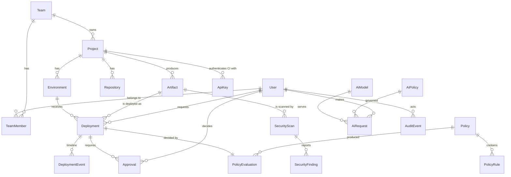
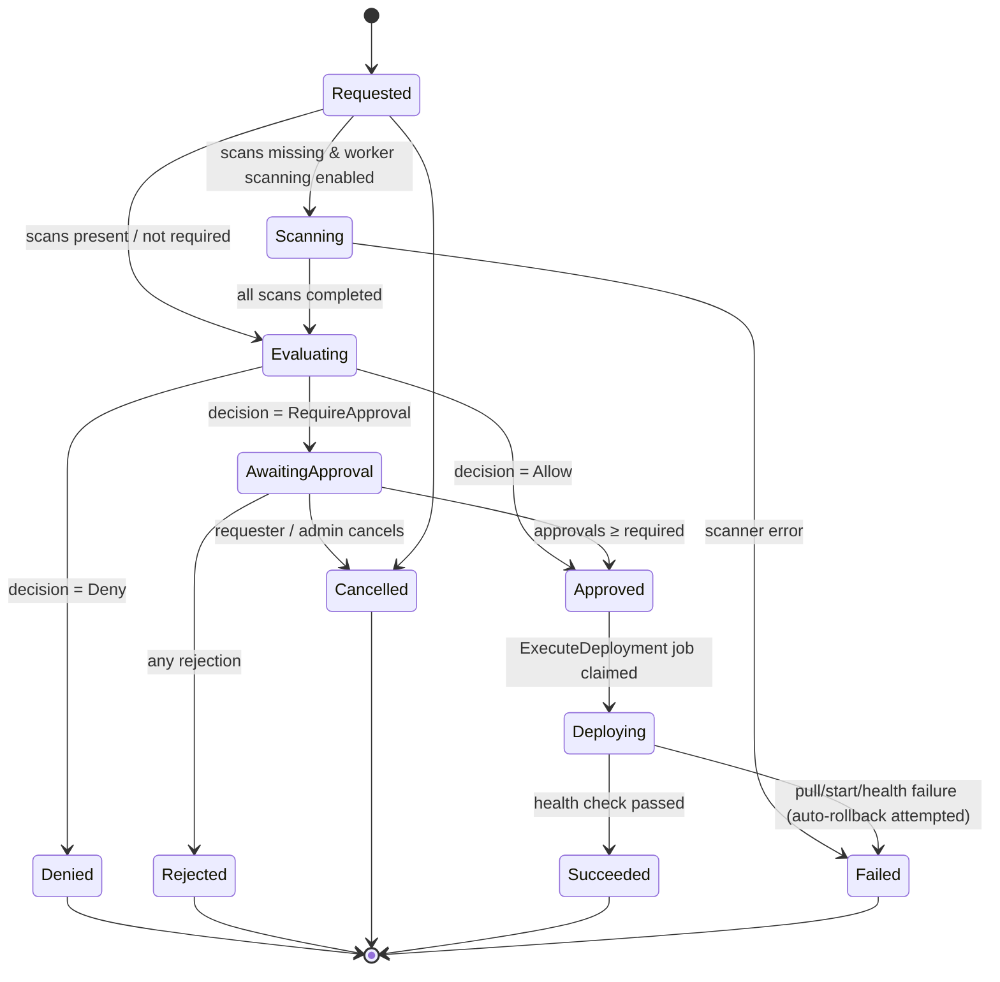
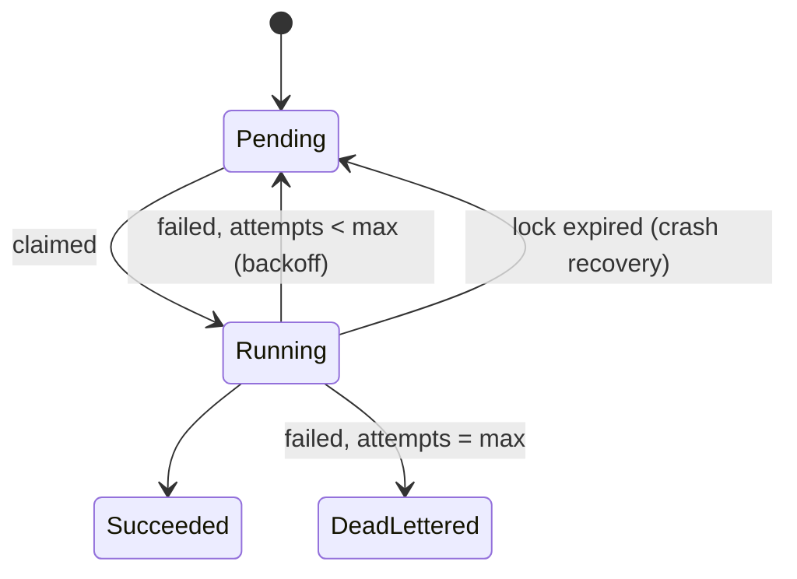

# 04 — Domain Model

All names in this document are **canonical**: use them verbatim for classes, enums, tables
and API fields (with the usual casing conventions per layer).

## 1. Aggregate map



## 2. Modules and entities

### 2.1 Identity & Access (`identity`)

| Entity | Key fields | Notes |
| --- | --- | --- |
| **User** | `Id`, `Email`, `DisplayName`, `IsActive`, `CreatedAt` + Identity fields | Global roles via Identity roles: `Admin`, `Developer`, `Security`, `Approver` |
| **RefreshToken** | `Id`, `UserId`, `TokenHash`, `ExpiresAt`, `RevokedAt`, `ReplacedByTokenId`, `CreatedByIp` | Rotation on every refresh; family revocation on reuse |
| **ApiKey** | `Id`, `ProjectId`, `Name`, `KeyPrefix` (8 chars), `KeyHash` (SHA-256), `Scopes[]`, `ExpiresAt`, `LastUsedAt`, `RevokedAt`, `CreatedById` | Plain key `aok_<prefix>_<secret>` shown once. Scopes: `artifacts:write`, `scans:write`, `deployments:request` |

### 2.2 Organization (`org`)

| Entity | Key fields | Notes |
| --- | --- | --- |
| **Team** | `Id`, `Name`, `Slug`, `Description`, `CreatedAt` | Unit of ownership and AI policy scope |
| **TeamMember** | `TeamId`, `UserId`, `Role: TeamRole`, `JoinedAt` | `Owner` may manage members; `Member` may deploy |
| **Project** | `Id`, `TeamId`, `Name`, `Slug`, `Description`, `IsArchived`, `CreatedAt` | Corresponds to one deployable service |
| **Repository** | `Id`, `ProjectId`, `Provider: RepositoryProvider`, `FullName` (`owner/repo`), `DefaultBranch`, `HtmlUrl` | Informational in v1 (no inbound webhooks) |
| **Environment** | `Id`, `ProjectId`, `Name`, `Tier: EnvironmentTier`, `Order`, `Target` (JSONB), `CurrentArtifactId?`, `LastDeploymentId?` | `Target` describes where the executor deploys (see §5) |

### 2.3 Artifacts & Security (`security`)

| Entity | Key fields | Notes |
| --- | --- | --- |
| **Artifact** | `Id`, `ProjectId`, `Version` (SemVer), `CommitSha`, `Branch`, `ImageReference` (`ghcr.io/org/svc:v1.8.2`), `ImageDigest?` (`sha256:…`), `CiProvider`, `CiRunId`, `CiRunUrl`, `BuildStatus: CheckStatus`, `TestStatus: CheckStatus`, `TestSummary` (JSONB: total/passed/failed/skipped), `CreatedById?`, `CreatedByApiKeyId?`, `CreatedAt` | Immutable once created except `ImageDigest` backfill. Unique `(ProjectId, Version)` |
| **SecurityScan** | `Id`, `ArtifactId`, `Scanner: ScannerType`, `Source: ScanSource`, `Status: ScanStatus`, `ReportFormat: ReportFormat`, `ToolVersion?`, `StartedAt?`, `CompletedAt?`, `Summary` (JSONB: counts per severity), `RawReportPath?`, `ErrorMessage?` | One scan per `(ArtifactId, Scanner)` — re-upload replaces findings |
| **SecurityFinding** | `Id`, `ScanId`, `ArtifactId` (denormalized), `Severity: Severity`, `RuleId`, `Title`, `Description`, `FilePath?`, `StartLine?`, `PackageName?`, `InstalledVersion?`, `FixedVersion?`, `Cve?`, `Fingerprint`, `Status: FindingStatus`, `SuppressedById?`, `SuppressionReason?`, `HelpUri?` | `Fingerprint` = hash(scanner, ruleId, location/package) for dedup across artifacts |

### 2.4 Policies (`policy`)

| Entity | Key fields | Notes |
| --- | --- | --- |
| **Policy** | `Id`, `Name`, `Description`, `Scope: PolicyScope`, `ScopeId?` (TeamId or ProjectId), `AppliesToTiers: EnvironmentTier[]`, `IsEnabled`, `Version`, `CreatedById`, `UpdatedById`, `CreatedAt`, `UpdatedAt` | `Version` increments on every rule change |
| **PolicyRule** | `Id`, `PolicyId`, `Type: PolicyRuleType`, `Effect: RuleEffect`, `Parameters` (JSONB), `Order`, `IsEnabled` | Parameter schema per type in [05 Policy engine](05-policy-engine.md) |
| **PolicyEvaluation** | `Id`, `DeploymentId`, `Decision: PolicyDecision`, `ApprovalsRequired`, `EvaluatedAt`, `EvaluatedPolicies` (JSONB: `[{policyId, version}]`), `RuleResults` (JSONB: `RuleResult[]`), `ContextSnapshot` (JSONB) | Immutable; the explanation shown in UI |

### 2.5 Deployments (`deploy`)

| Entity | Key fields | Notes |
| --- | --- | --- |
| **Deployment** | `Id`, `ProjectId`, `EnvironmentId`, `ArtifactId`, `Status: DeploymentStatus`, `RequestedById?`, `RequestedByApiKeyId?`, `RequestedAt`, `Reason?`, `PolicyEvaluationId?`, `ApprovalsRequired`, `ApprovalsReceived`, `StartedAt?`, `CompletedAt?`, `FailureReason?`, `PreviousArtifactId?`, `CorrelationId`, `RowVersion` | State machine in §4. `PreviousArtifactId` enables rollback |
| **DeploymentEvent** | `Id`, `DeploymentId`, `Sequence`, `Timestamp`, `Type: DeploymentEventType`, `Message`, `Data` (JSONB) | Append-only timeline; broadcast via SignalR |
| **Approval** | `Id`, `DeploymentId`, `ApproverId`, `Decision: ApprovalDecision`, `Comment`, `DecidedAt` | Unique `(DeploymentId, ApproverId)`; approver ≠ requester |

### 2.6 AI Gateway (`ai`)

| Entity | Key fields | Notes |
| --- | --- | --- |
| **AiModel** | `Id`, `Name` (`llama3.2:3b`), `Provider: AiProvider`, `DisplayName`, `IsEnabled`, `MaxContextTokens`, `Capabilities[]` (`chat`, `code`) | Mirrors what is pulled in Ollama |
| **AiPolicy** | `Id`, `Name`, `Scope: PolicyScope` (`Global` or `Team` only), `ScopeId?`, `AllowedModelIds[]`, `RequestsPerMinute`, `RequestsPerDay`, `MaxPromptChars`, `SensitiveDataAction: SensitiveDataAction`, `BlockedPatterns[]`, `RedactPii`, `StoreContent`, `IsEnabled`, `Version`, `UpdatedById`, `UpdatedAt` | Effective policy = the enabled Team policy if one exists, otherwise Global (no merging — see [08 §2](08-ai-gateway.md#2-effective-policy-resolution)) |
| **AiRequest** | `Id`, `UserId`, `TeamId?`, `AiModelId`, `AiPolicyId`, `Status: AiRequestStatus`, `Purpose: AiPurpose`, `PromptChars`, `ResponseChars`, `PromptTokens?`, `CompletionTokens?`, `LatencyMs`, `DetectedSensitiveTypes[]`, `RedactionsApplied`, `BlockReason?`, `PromptHash`, `PromptPreview?` (redacted, ≤ 500 chars), `ResponsePreview?`, `CorrelationId`, `CreatedAt` | Full content stored only when `AiPolicy.StoreContent = true` |

### 2.7 Audit (`audit`)

| Entity | Key fields | Notes |
| --- | --- | --- |
| **AuditEvent** | `Id`, `Timestamp`, `ActorType: ActorType`, `ActorId?`, `ActorDisplay`, `Action` (e.g. `deployment.approved`), `ResourceType`, `ResourceId`, `Outcome: AuditOutcome`, `IpAddress?`, `UserAgent?`, `CorrelationId`, `Metadata` (JSONB) | Append-only. Action naming: `<resource>.<verb>` |

### 2.8 Jobs (`jobs`)

| Entity | Key fields | Notes |
| --- | --- | --- |
| **Job** | `Id`, `Type: JobType`, `Payload` (JSONB), `Status: JobStatus`, `Attempts`, `MaxAttempts`, `ScheduledAt`, `LockedAt?`, `LockedBy?`, `CompletedAt?`, `LastError?`, `CorrelationId`, `CreatedAt` | Claimed with `FOR UPDATE SKIP LOCKED`; exponential backoff on failure |

## 3. Enumerations

| Enum | Values |
| --- | --- |
| `UserRole` | `Admin`, `Developer`, `Security`, `Approver` |
| `TeamRole` | `Owner`, `Member` |
| `RepositoryProvider` | `GitHub` |
| `EnvironmentTier` | `Development`, `Staging`, `Production` |
| `CheckStatus` | `Unknown`, `Passed`, `Failed`, `Skipped` |
| `ScannerType` | `Gitleaks`, `Trivy`, `Semgrep` |
| `ScanSource` | `CiUploaded`, `WorkerExecuted` |
| `ScanStatus` | `Queued`, `Running`, `Completed`, `Failed` |
| `ReportFormat` | `Sarif`, `TrivyJson`, `GitleaksJson`, `SemgrepJson` |
| `Severity` | `Critical`, `High`, `Medium`, `Low`, `Info`, `Unknown` |
| `FindingStatus` | `Open`, `Suppressed`, `Resolved` |
| `PolicyScope` | `Global`, `Team`, `Project` |
| `PolicyRuleType` | `RequireTestsPassed`, `RequireScan`, `MaxFindings`, `RequireApprovals`, `AllowedBranches`, `DeploymentWindow`, `RequireImageDigest`, `RequirePriorEnvironment` |
| `RuleEffect` | `Deny`, `RequireApproval`, `Warn` |
| `PolicyDecision` | `Allow`, `RequireApproval`, `Deny` |
| `DeploymentStatus` | `Requested`, `Scanning`, `Evaluating`, `Denied`, `AwaitingApproval`, `Rejected`, `Approved`, `Deploying`, `Succeeded`, `Failed`, `Cancelled` |
| `DeploymentEventType` | `Requested`, `ScanStarted`, `ScanCompleted`, `PolicyEvaluated`, `ApprovalRequested`, `ApprovalReceived`, `Approved`, `Rejected`, `Denied`, `DeployStarted`, `ImagePulled`, `ContainerStarted`, `HealthCheckPassed`, `HealthCheckFailed`, `RolledBack`, `Succeeded`, `Failed`, `Cancelled`, `Note` |
| `ApprovalDecision` | `Approved`, `Rejected` |
| `AiProvider` | `Ollama` |
| `AiPurpose` | `Chat`, `DeploymentSummary`, `FindingsExplanation` |
| `AiRequestStatus` | `Completed`, `Blocked`, `Failed` |
| `SensitiveDataAction` | `Allow`, `Redact`, `Block` |
| `ActorType` | `User`, `ApiKey`, `System` |
| `AuditOutcome` | `Success`, `Failure`, `Denied` |
| `JobType` | `EvaluateDeployment`, `ExecuteDeployment`, `RunSecurityScan`, `ParseScanReport`, `SendNotification` |
| `JobStatus` | `Pending`, `Running`, `Succeeded`, `Failed`, `DeadLettered` |

## 4. State machines

### 4.1 Deployment



Rules enforced in `Deployment.TransitionTo()`:

- Only transitions in the diagram are legal; anything else throws `InvalidDeploymentTransitionException`.
- Terminal states: `Denied`, `Rejected`, `Cancelled`, `Succeeded`, `Failed`.
- Every transition appends a `DeploymentEvent` and raises a `DeploymentStatusChanged` domain event.
- `Approved → Deploying` re-checks time-sensitive rules (`DeploymentWindow`) — if now failing, `Approved → Denied` with event `Denied` ("window closed while awaiting execution").

### 4.2 Job



### 4.3 SecurityScan

`Queued → Running → Completed | Failed`. CI-uploaded scans are created directly as
`Completed` (or `Failed` if the report cannot be parsed).

## 5. Value objects & JSON shapes

### `Environment.Target` (JSONB)

```json
{
  "type": "docker",
  "containerName": "circuit-service-staging",
  "network": "aegisops-staging",
  "hostPort": 8102,
  "containerPort": 8080,
  "healthPath": "/health",
  "healthTimeoutSeconds": 60,
  "env": { "ASPNETCORE_ENVIRONMENT": "Staging" },
  "allowApiKeyProduction": false
}
```

`type` is the executor discriminator. v1 supports `docker` and `noop` (simulated).
`allowApiKeyProduction` (default `false`) lets CI API keys request deployments to a
`Production`-tier environment; otherwise production requests must come from a user
(see [09 §7](09-identity-and-authorization.md#7-api-keys-ci-service-principals)).

### `Artifact.TestSummary` (JSONB)

```json
{ "total": 128, "passed": 128, "failed": 0, "skipped": 0, "durationSeconds": 41.2 }
```

### `SecurityScan.Summary` (JSONB)

```json
{ "critical": 0, "high": 2, "medium": 5, "low": 11, "info": 0, "unknown": 0, "total": 18 }
```

### `PolicyEvaluation.RuleResults` (JSONB)

```json
[
  {
    "policyId": "0190…", "policyName": "Production baseline", "policyVersion": 4,
    "ruleId": "0190…", "type": "MaxFindings", "effect": "Deny",
    "passed": false,
    "message": "1 CRITICAL finding exceeds limit 0 (scanner: Trivy)",
    "evidence": { "scanner": "Trivy", "severity": "Critical", "count": 1, "limit": 0,
                  "findingIds": ["0190…"] }
  }
]
```

### `PolicyEvaluation.ContextSnapshot` (JSONB)

Frozen inputs so a decision can be re-derived later: artifact id/version/branch/digest,
test status, scan summaries per scanner, environment tier, requester id/roles, evaluation
time (UTC) and timezone used for window rules, prior-environment status.

## 6. Invariants

| Invariant | Enforced in |
| --- | --- |
| `Artifact.Version` unique per project | DB unique index + application check |
| One `SecurityScan` per `(Artifact, Scanner)` | DB unique index; re-upload replaces findings in a transaction |
| Approver cannot be the requester | `Approval` creation handler (Domain) |
| One approval per approver per deployment | DB unique index |
| Approvals only accepted while `AwaitingApproval` | `Deployment.AddApproval()` |
| Policy `Version` increments on any rule change | `Policy.AddRule/UpdateRule/RemoveRule` |
| `AuditEvent` rows are never updated or deleted | DB role privileges + no EF update path |
| Deployment to `Production` must reference an artifact that `Succeeded` in `Staging` | `RequirePriorEnvironment` rule (policy, not hard invariant — teams may opt out) |
| `Environment.CurrentArtifactId` only changes on `Succeeded` | `ExecuteDeploymentHandler` |

## 7. Domain events

| Event | Raised by | Consumers |
| --- | --- | --- |
| `DeploymentRequested` | `Deployment` ctor | enqueue `EvaluateDeployment`, audit, realtime |
| `DeploymentStatusChanged` | `TransitionTo` | realtime, audit, notifications |
| `DeploymentApprovalRequested` | evaluation handler | notify approvers |
| `DeploymentApproved` | `AddApproval` (quorum) | enqueue `ExecuteDeployment` |
| `ScanCompleted` | scan ingestion | realtime; if a deployment is `Scanning`, check readiness |
| `PolicyChanged` | `Policy` mutators | audit, cache invalidation |
| `AiRequestBlocked` | AI gateway | audit, metrics |

Events are dispatched **after** `SaveChangesAsync` succeeds. Consumers that need durability
enqueue a `Job` in the same transaction instead of doing the work inline.
