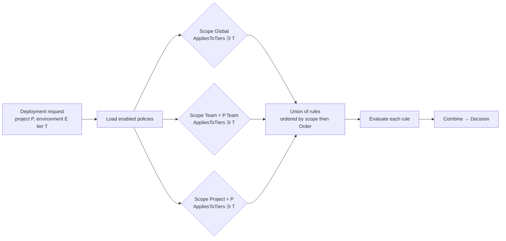

# 05 — Policy Engine

The policy engine is the core of AegisOps. It answers one question deterministically:

> Given this **artifact**, its **checks and scans**, this **environment**, this
> **requester**, and the **current time** — may the deployment proceed?

Answer: `Allow`, `RequireApproval(n)`, or `Deny` — always with a rule-by-rule explanation.

## 1. Design principles

1. **Policy is data.** Rules are rows with typed JSON parameters; changing behaviour does
   not require a deployment of AegisOps.
2. **Pure evaluation.** `IPolicyEngine.Evaluate(PolicyContext)` is a pure function of its
   inputs. No I/O inside rules. All data is loaded first into `PolicyContext`.
3. **Most restrictive wins.** Multiple applicable policies are merged; `Deny` beats
   `RequireApproval` beats `Allow`.
4. **Explainable.** Every rule returns `passed`, a human message and machine-readable
   evidence. Results are persisted as `PolicyEvaluation`.
5. **Fail closed.** Missing data that a rule needs (e.g. no Trivy scan) makes the rule fail,
   never pass.
6. **Separation from authorization.** Authorization asks *"may this user call this
   endpoint?"*. The policy engine asks *"may this change reach this environment?"*.

## 2. Policy resolution



- All matching policies apply (union), not just the most specific. This lets a global
  baseline ("never deploy with critical findings") remain enforced while teams add
  stricter rules.
- Disabled policies and disabled rules are skipped but listed in `EvaluatedPolicies` for
  transparency.
- Evaluated policy versions are frozen into the `PolicyEvaluation`.

## 3. `PolicyContext`

Built by `PolicyContextBuilder` (Application) before evaluation:

```csharp
public sealed record PolicyContext(
    DeploymentRef Deployment,           // id, requestedAt, requester (id, roles, teamRole)
    ArtifactRef Artifact,               // version, branch, commitSha, imageDigest, buildStatus, testStatus, testSummary
    EnvironmentRef Environment,         // id, name, tier, project, team
    IReadOnlyList<ScanRef> Scans,       // per scanner: status, summary counts, open findings (severity, ruleId, cve, package)
    IReadOnlyList<ApprovalRef> Approvals,
    PriorEnvironmentRef? PriorEnvironment, // status of same artifact in previous tier
    DateTimeOffset Now,
    TimeZoneInfo TimeZone);
```

Findings with `Status = Suppressed` are excluded from counts. Suppression itself is audited
and requires the `Security` or `Admin` role.

## 4. Rule catalogue (v1)

Every rule has `Type`, `Effect` (`Deny` | `RequireApproval` | `Warn`) and `Parameters`.
A rule that **passes** contributes nothing. A rule that **fails** contributes its `Effect`.
`Warn` never changes the decision; it only annotates the result.

| Type | Parameters (JSON) | Passes when | Typical use |
| --- | --- | --- | --- |
| `RequireTestsPassed` | `{}` | `Artifact.TestStatus == Passed` and `BuildStatus == Passed` | All tiers, `Deny` |
| `RequireScan` | `{ "scanners": ["Gitleaks","Trivy","Semgrep"], "maxAgeHours": 168 }` | A `Completed` scan exists for each listed scanner, not older than `maxAgeHours` | Staging+, `Deny` |
| `MaxFindings` | `{ "scanner": "Trivy" \| null, "severity": "Critical", "max": 0, "includeUnknown": false }` | Count of open findings with severity ≥ `severity` (for the scanner, or all) ≤ `max` | Prod: Critical=0 `Deny`, High≤3 `RequireApproval` |
| `RequireApprovals` | `{ "count": 2, "roles": ["Approver","Security","Admin"], "distinctTeams": false }` | `count` approvals from users with any listed role; requester excluded | Production |
| `AllowedBranches` | `{ "patterns": ["main", "release/*", "refs/tags/v*"] }` | `Artifact.Branch` matches any glob | Production from `main` only |
| `DeploymentWindow` | `{ "timezone": "Asia/Kuala_Lumpur", "allowed": [{ "days": ["Mon","Tue","Wed","Thu"], "from": "09:00", "to": "18:00" }, { "days": ["Fri"], "from": "09:00", "to": "15:00" }] }` | `Now` in an allowed window | No Friday-evening production deploys |
| `RequireImageDigest` | `{}` | `Artifact.ImageDigest` present (`sha256:…`) | Production immutability |
| `RequirePriorEnvironment` | `{ "tier": "Staging", "status": "Succeeded", "maxAgeHours": 720 }` | Same artifact has a `Succeeded` deployment in the given tier | Production must be preceded by Staging |

### Parameter validation

Each rule type has a matching C# record (`MaxFindingsParameters`, …) with a FluentValidation
validator. Invalid parameters are rejected at policy-edit time (HTTP 400), so evaluation
never sees malformed rules. Unknown `Type` values are rejected.

## 5. Evaluation algorithm

```text
Evaluate(ctx):
  results = []
  approvalsRequired = 0
  approvalRoles = ∅

  for policy in applicablePolicies(ctx):                  # global ∪ team ∪ project, enabled, tier match
    for rule in policy.Rules.Where(r => r.IsEnabled).OrderBy(r => r.Order):
      r = RuleEvaluator.For(rule.Type).Evaluate(rule.Parameters, ctx)   # pure
      results.Add(RuleResult(policy, rule, r.Passed, r.Message, r.Evidence))
      if rule.Type == RequireApprovals:
        approvalsRequired = max(approvalsRequired, params.count)
        approvalRoles ∪= params.roles
        # RequireApprovals "fails" only for reporting; quorum is checked separately

  denies         = results.Where(!passed && effect == Deny)
  escalations    = results.Where(!passed && effect == RequireApproval)

  if denies.Any():                                → Decision.Deny
  elif approvalsRequired > 0 || escalations.Any():
      approvalsRequired = max(approvalsRequired, escalations.Any() ? 1 : 0)
      if satisfiedApprovals(ctx.Approvals, approvalRoles) >= approvalsRequired:
                                                  → Decision.Allow
      else                                        → Decision.RequireApproval(approvalsRequired, approvalRoles)
  else                                            → Decision.Allow
```

Notes:

- `RequireApprovals` sets the quorum; a failing `RequireApproval`-effect rule (e.g. High
  findings > 3) forces at least 1 approval. Roles default to `Approver, Security, Admin` if
  none listed.
- The same `Evaluate` runs at three points: on request, after each approval (to check
  quorum), and immediately before execution (time-sensitive rules).
- Evaluation is idempotent and side-effect free; the handler persists results.

## 6. Decision → deployment status

| Decision | Deployment status | Events |
| --- | --- | --- |
| `Deny` | `Denied` | `PolicyEvaluated`, `Denied` |
| `RequireApproval(n)` | `AwaitingApproval` with `ApprovalsRequired = n` | `PolicyEvaluated`, `ApprovalRequested` |
| `Allow` | `Approved` → enqueue `ExecuteDeployment` | `PolicyEvaluated`, `Approved` |

## 7. Worked examples

### Seeded policies (demo data)

| Policy | Scope | Tiers | Rules |
| --- | --- | --- | --- |
| **Global baseline** | Global | all | `RequireTestsPassed` (Deny) · `MaxFindings{Critical,0}` (Deny) |
| **Staging gate** | Global | Staging | `RequireScan{Gitleaks,Trivy,Semgrep}` (Deny) · `MaxFindings{High,10}` (Warn) |
| **Production gate** | Global | Production | `RequireScan{all}` (Deny) · `MaxFindings{High,3}` (RequireApproval) · `RequireApprovals{2}` · `AllowedBranches{main, refs/tags/v*}` (Deny) · `RequireImageDigest` (Deny) · `RequirePriorEnvironment{Staging}` (Deny) · `DeploymentWindow{Mon–Thu 09–18, Fri 09–15 MYT}` (Deny) |
| **Network team – extra** | Team `network-platform` | Production | `MaxFindings{Semgrep, Medium, 0}` (RequireApproval) |

### Example 1 — clean production deploy

Context: tests passed · all scans present · Trivy 0C/1H · branch `main` · digest present ·
staging succeeded 2h ago · Tue 14:00 MYT · 0 approvals.

Result: all rules pass except quorum → **`RequireApproval(2)`**. After 2 approvals from
`Approver`/`Security` users ≠ requester → re-evaluate → **`Allow`**.

### Example 2 — critical CVE

Same as above but Trivy 1C. Global baseline `MaxFindings{Critical,0}` fails with `Deny` →
**`Deny`**. Approvals cannot override.

### Example 3 — Friday 17:30

Same as example 1 but Fri 17:30 MYT. `DeploymentWindow` fails → **`Deny`** with message
*"Outside allowed window (Fri 09:00–15:00 Asia/Kuala_Lumpur); next window Mon 09:00"*.

### Example 4 — staging with warnings

Staging, tests passed, scans present, Trivy 0C/12H. `MaxFindings{High,10}` is `Warn` →
**`Allow`** with a warning annotation shown in the UI.

### Example 5 — skipped staging

Production, artifact never deployed to Staging. `RequirePriorEnvironment` fails → **`Deny`**.

## 8. Explainability contract (API shape)

`GET /api/v1/deployments/{id}/evaluation` returns:

```json
{
  "decision": "RequireApproval",
  "approvalsRequired": 2,
  "approvalsReceived": 0,
  "evaluatedAt": "2026-09-24T06:12:03Z",
  "policies": [{ "id": "…", "name": "Production gate", "version": 4, "scope": "Global" }],
  "rules": [
    { "policy": "Global baseline", "type": "RequireTestsPassed", "effect": "Deny", "passed": true,
      "message": "Build and tests passed (128/128)" },
    { "policy": "Production gate", "type": "MaxFindings", "effect": "RequireApproval", "passed": true,
      "message": "1 HIGH finding within limit 3 (Trivy)" },
    { "policy": "Production gate", "type": "RequireApprovals", "effect": "RequireApproval", "passed": false,
      "message": "0 of 2 required approvals from [Approver, Security, Admin]" }
  ],
  "warnings": []
}
```

## 9. Extensibility

Adding a rule type = one class implementing `IRuleEvaluator` + parameters record +
validator + tests + a UI form section. The registry is discovered via DI
(`IEnumerable<IRuleEvaluator>` keyed by `PolicyRuleType`). Candidates for V2:
`RequireSbom`, `MaxArtifactAge`, `RequireChangeTicket`, `RequireSignedImage` (cosign).

## 10. Test matrix

The policy engine is tested exhaustively; see
[16 Testing strategy §3](16-testing-strategy.md#3-policy-engine-test-matrix).
