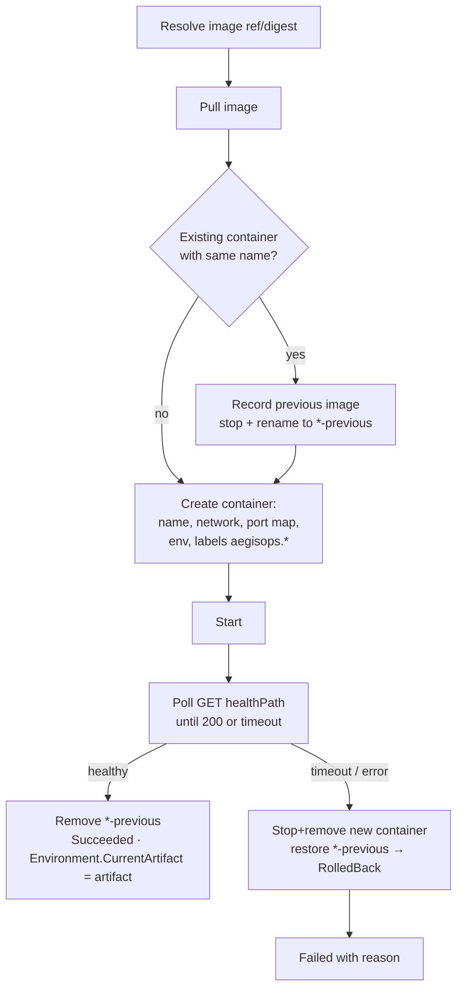

# 06 — Deployment Pipeline

This document describes the full life of a deployment: from a `git push` in a target
repository to a running container, including the worker, jobs and executors.

## 1. Responsibilities split

```
┌────────────────────────── GitHub Actions (does the work) ──────────────────────────┐
│ checkout → build → test → docker build/push → gitleaks → semgrep → trivy           │
│         → register artifact → upload scans → request deployment                    │
└─────────────────────────────────────────────┬──────────────────────────────────────┘
                                              ▼
┌────────────────────────── AegisOps (makes & records the decision) ─────────────────┐
│ artifact + scans → policy evaluation → approvals → execution → timeline → audit    │
└────────────────────────────────────────────────────────────────────────────────────┘
```

AegisOps never clones or builds source in v1. It consumes **facts** (artifact metadata,
test results, scan reports) and produces **decisions** and **actions**.

## 2. End-to-end sequence

| Step | Actor | Call | Result |
| --- | --- | --- | --- |
| 1 | CI | `POST /api/v1/projects/{slug}/artifacts` | `Artifact` created (`201`) or returned if same `(project, version)` and `Idempotency-Key` |
| 2 | CI | `POST /api/v1/artifacts/{id}/scans` ×3 | `SecurityScan` + `SecurityFinding[]` persisted; summary computed |
| 3 | CI or user | `POST /api/v1/deployments` `{ artifactId, environmentId }` | `Deployment(Requested)`, `Job(EvaluateDeployment)`, audit, realtime (`202`) |
| 4 | Worker | claim `EvaluateDeployment` | `Scanning` (if configured & scans missing) → `Evaluating` → `PolicyEvaluation` → `Denied` / `AwaitingApproval` / `Approved` |
| 5 | Approvers | `POST /api/v1/deployments/{id}/approvals` | `Approval` saved; quorum → `Approved` + `Job(ExecuteDeployment)`; rejection → `Rejected` |
| 6 | Worker | claim `ExecuteDeployment` | re-check time rules → `Deploying` → executor → `Succeeded` / `Failed` (with rollback attempt) |
| 7 | Everyone | SignalR / `GET /deployments/{id}` | Timeline and status |

## 3. Job queue (durable, PostgreSQL)

Rationale in [ADR-0005](adr/0005-durable-job-queue-in-postgresql.md).

### Table `jobs.jobs`

See [11 Database design](11-database-design.md#jobs). Key semantics:

- **Enqueue** happens in the same transaction as the business change (outbox-lite):
  a deployment cannot exist without its evaluation job and vice-versa.
- **Claim** (Worker, every 1 s with jitter, batch ≤ 10):

  ```sql
  UPDATE jobs.jobs SET status = 'Running', locked_at = now(), locked_by = @worker, attempts = attempts + 1
  WHERE id IN (
      SELECT id FROM jobs.jobs
      WHERE status = 'Pending' AND scheduled_at <= now()
      ORDER BY scheduled_at
      FOR UPDATE SKIP LOCKED
      LIMIT @batch)
  RETURNING *;
  ```

- **Complete**: `Succeeded` + `completed_at`.
- **Fail**: if `attempts < max_attempts` → `Pending` with `scheduled_at = now() + backoff`
  (`30s · 2^(attempts-1)`, capped at 15 min); else `DeadLettered` with `last_error`.
- **Crash recovery**: a reaper resets `Running` jobs with `locked_at < now() - 10 min` to
  `Pending`. Handlers must therefore be idempotent (they re-read the deployment status and
  no-op if already past their step).
- **Ordering**: jobs for the same deployment carry `Payload.deploymentId`; the dispatcher
  never runs two jobs for the same deployment concurrently (Redis lock
  `lock:deployment:{id}`, TTL 10 min).

### Job types and handlers

| `JobType` | Payload | Handler | Phase |
| --- | --- | --- | --- |
| `EvaluateDeployment` | `{ deploymentId }` | `EvaluateDeploymentJobHandler` | 1 |
| `ExecuteDeployment` | `{ deploymentId }` | `ExecuteDeploymentJobHandler` | 1 (noop) / 4 (docker) |
| `ParseScanReport` | `{ scanId, reportPath }` | `ParseScanReportJobHandler` (large reports parsed async) | 3 |
| `RunSecurityScan` | `{ artifactId, scanner }` | `RunSecurityScanJobHandler` (worker-run scanners) | 4 (optional) |
| `SendNotification` | `{ kind, recipients, deploymentId }` | `SendNotificationJobHandler` (log/webhook) | 5 |

### Worker hosting

```
AegisOps.Worker
 ├── JobDispatcherService : BackgroundService   — polls, claims, dispatches to IJobHandler<T>, respects CancellationToken
 ├── StaleJobReaperService : BackgroundService  — crash recovery
 ├── RealtimeBridge                              — publishes events to Redis for the Api hub
 └── /health, /metrics                           — minimal endpoints for Compose/Prometheus
```

Concurrency: `Worker:MaxConcurrency` (default 4) via `SemaphoreSlim`; graceful shutdown
waits for in-flight jobs (up to `HostOptions.ShutdownTimeout = 30s`).

## 4. Evaluation job

```text
EvaluateDeploymentJobHandler(deploymentId):
  d = load Deployment (with env, artifact, project)
  if d.Status not in [Requested, Scanning]: return            # idempotent
  if scansRequiredButMissing(d) and Worker:RunScans enabled:
      d.TransitionTo(Scanning); enqueue RunSecurityScan per missing scanner; return
  d.TransitionTo(Evaluating)
  ctx = PolicyContextBuilder.Build(d, now)
  result = PolicyEngine.Evaluate(ctx)
  save PolicyEvaluation(result, ctx snapshot)
  switch result.Decision:
    Deny            → d.TransitionTo(Denied)
    RequireApproval → d.ApprovalsRequired = n; d.TransitionTo(AwaitingApproval); notify approvers
    Allow           → d.TransitionTo(Approved); enqueue ExecuteDeployment
  audit("deployment.evaluated", outcome)
  commit
```

## 5. Approval handling (Api)

```text
AddApprovalHandler(deploymentId, approver, decision, comment):
  authorize: approver has role ∈ policy roles; approver ≠ requester; is team member or Admin
  d.AddApproval(...)                     # throws if status ≠ AwaitingApproval or duplicate
  if decision == Rejected: d.TransitionTo(Rejected)
  else:
     result = PolicyEngine.Evaluate(ctx with approvals)       # quorum check + re-check other rules
     if result.Decision == Allow: d.TransitionTo(Approved); enqueue ExecuteDeployment
  audit("deployment.approved" | "deployment.rejected")
  commit
```

## 6. Execution job and executors

### Executor abstraction

```csharp
public interface IDeploymentExecutor
{
    string Type { get; }                    // "noop" | "docker"
    Task<ExecutionResult> ExecuteAsync(ExecutionRequest request, IProgress<DeploymentEventDraft> progress, CancellationToken ct);
    Task<ExecutionResult> RollbackAsync(ExecutionRequest request, ArtifactRef previous, IProgress<DeploymentEventDraft> progress, CancellationToken ct);
}
```

The executor is chosen by `Environment.Target.type`. Progress reports become
`DeploymentEvent`s (and SignalR messages) in real time.

### `NoopDeploymentExecutor` (Phase 1)

Simulates a deployment: emits `DeployStarted → ImagePulled → ContainerStarted →
HealthCheckPassed → Succeeded` with small delays. Lets the whole flow, UI and tests work
before Docker integration exists. Can be forced to fail via `Target.simulateFailure`.

### `DockerDeploymentExecutor` (Phase 4)



- Uses **Docker.DotNet** against `/var/run/docker.sock` mounted into the Worker only.
- Containers are labelled `aegisops.project`, `aegisops.environment`, `aegisops.deployment`,
  `aegisops.artifact` so they can be listed/cleaned (`GET /environments/{id}/runtime`).
- Image must be pulled by **digest** when `Artifact.ImageDigest` is set.
- Registry auth (GHCR) via `Docker:Registries[]` configuration (token from env var).
- Security note: Docker socket access equals root on the host. Mitigations in
  [17 Security hardening §4](17-security-hardening.md#4-docker-socket-exposure).

### Time-rule re-check before execution

`ExecuteDeploymentJobHandler` runs `PolicyEngine.Evaluate` once more with `Now = now`
**only considering time-sensitive rules** (`DeploymentWindow`). If it fails, the deployment
becomes `Denied` with an explanatory event instead of `Deploying`.

## 7. Deployment timeline (events)

Example for a production deployment, as rendered live in the UI:

```
14:31:02  Requested             by aina@… via API key "ci-circuit-service"
14:31:03  PolicyEvaluated       RequireApproval (2) — 7 rules, 6 passed
14:31:03  ApprovalRequested     waiting for 2 approvals from Approver/Security/Admin
14:40:19  ApprovalReceived      farid@… approved: "Reviewed Trivy HIGH, accepted"
14:42:51  ApprovalReceived      mei@… approved
14:42:51  Approved              quorum reached
14:42:52  DeployStarted         executor=docker target=circuit-service-production
14:42:58  ImagePulled           ghcr.io/…/circuit-service@sha256:9f2c…
14:42:59  ContainerStarted      circuit-service-production (previous: v1.8.1)
14:43:04  HealthCheckPassed     GET /health → 200 in 5.1s
14:43:04  Succeeded             duration 12s
```

## 8. Rollback

Rollback is **a new deployment** of `Environment.CurrentArtifactId`'s predecessor
(`Deployment.PreviousArtifactId`) — it goes through the same policy evaluation (usually
`Allow`, since the artifact already passed once). `POST /deployments/{id}/rollback` is a
convenience endpoint that creates that deployment with `Reason = "rollback of {id}"`.
Auto-rollback inside the executor (health-check failure) restores the previous container
but does not create a new `Deployment`; it is recorded as a `RolledBack` event on the
failed deployment.

## 9. Idempotency & retries

| Concern | Mechanism |
| --- | --- |
| CI retries `POST /artifacts` | `Idempotency-Key` (Redis, 24h) → same `201/200` body; also natural key `(project, version)` |
| CI retries `POST /deployments` | `Idempotency-Key` required for API-key callers; returns existing deployment |
| Duplicate job execution | Handlers check current status first; DB `RowVersion` concurrency on `Deployment` |
| Two workers, same deployment | Redis lock per deployment id |
| Worker crash mid-deploy | Job reaped → re-run → executor detects half-applied state via container labels and continues/rolls back |

## 10. Cancellation

`POST /deployments/{id}/cancel` is allowed for the requester, team owners and admins while
status ∈ `{Requested, AwaitingApproval}`. Deployments already `Approved`/`Deploying` cannot
be cancelled in v1 (a cancellation token for the executor is a V2 item).

## 11. Notifications (Phase 5)

`ApprovalRequested`, `Approved`, `Denied`, `Succeeded`, `Failed` produce `SendNotification`
jobs. v1 channels: SignalR toast to relevant users and a generic outbound **webhook** per
team (JSON POST with HMAC signature). Email/Slack are V2.
