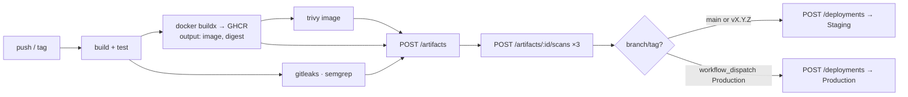

# 14 — DevOps & Infrastructure

## 1. Local / demo topology (Docker Compose)

```
docker compose up -d                      # core: postgres, redis, migrate, api, worker, web
docker compose --profile ai up -d         # + ollama, ollama-init
docker compose --profile observability up -d   # + prometheus, grafana
docker compose -f deploy/docker-compose.targets.yml up -d   # target networks + latest target images
```

### `docker-compose.yml` (services)

| Service | Image | Ports | Depends on | Notes |
| --- | --- | --- | --- | --- |
| `postgres` | `postgres:17-alpine` | 5432 (dev only) | — | volume `pgdata`; `POSTGRES_DB=aegisops`; healthcheck `pg_isready` |
| `redis` | `redis:7-alpine` | 6379 (dev only) | — | `--maxmemory 256mb --maxmemory-policy allkeys-lru`; no persistence needed |
| `migrate` | `aegisops-api` | — | postgres healthy | one-shot: `dotnet AegisOps.Api.dll --migrate --seed`; `restart: "no"` |
| `api` | `aegisops-api` (built from `src/AegisOps.Api/Dockerfile`) | 8080 internal | migrate completed, redis | env: connection strings, JWT signing key, Ollama URL; volume `reports` |
| `worker` | `aegisops-worker` | 8081 internal (health/metrics) | migrate completed | mounts `/var/run/docker.sock:ro` (Phase 4); volume `reports` |
| `web` | `aegisops-web` (nginx) | **3000** | api | serves SPA, proxies `/api`, `/hubs` |
| `ollama` | `ollama/ollama` | 11434 internal | — | profile `ai`; volume `ollama`; GPU passthrough optional |
| `ollama-init` | `ollama/ollama` | — | ollama | profile `ai`; `ollama pull llama3.2:3b` then exits |
| `prometheus` | `prom/prometheus` | 9090 | api, worker | profile `observability`; config `deploy/prometheus/prometheus.yml` |
| `grafana` | `grafana/grafana` | **3001** | prometheus | profile `observability`; provisioned datasource + dashboards from `deploy/grafana/` |

Networks: `aegisops` (platform). Target networks `aegisops-staging`, `aegisops-production`
are created by the targets compose file (external) so the Worker can attach containers.

`docker-compose.override.yml` (dev): exposes Postgres/Redis ports, mounts source for the
web dev server (`vite` with HMR on 5173 proxying to `api`), enables Scalar anonymously.

### Environment variables (api / worker)

| Variable | Example | Notes |
| --- | --- | --- |
| `ConnectionStrings__Postgres` | `Host=postgres;Database=aegisops;Username=aegisops_app;Password=…` | app role |
| `ConnectionStrings__PostgresMigrator` | `…Username=aegisops_migrator…` | used only by `--migrate` |
| `ConnectionStrings__Redis` | `redis:6379` | |
| `Jwt__Issuer`, `Jwt__Audience`, `Jwt__SigningKey` | | ≥ 32 random bytes; generated by `scripts/gen-secrets.sh` into `.env` |
| `Jwt__AccessTokenMinutes`, `Jwt__RefreshTokenDays` | `15`, `7` | |
| `Ai__Ollama__BaseUrl` | `http://ollama:11434` | |
| `Storage__ReportsPath` | `/data/reports` | volume |
| `Worker__MaxConcurrency`, `Worker__RunScans` | `4`, `false` | |
| `Docker__Endpoint` | `unix:///var/run/docker.sock` | worker only |
| `Docker__Registries__0__Server`, `…Username`, `…Token` | GHCR creds | worker only |
| `Seed__Demo` | `true` | demo data |
| `OTEL_EXPORTER_OTLP_ENDPOINT` | optional | traces |
| `Cors__AllowedOrigins__0` | `http://localhost:5173` | dev only |

`.env.example` is committed; `.env` is git-ignored and scanned by Gitleaks anyway.

## 2. Dockerfiles

### API / Worker (multi-stage)

```dockerfile
FROM mcr.microsoft.com/dotnet/sdk:10.0 AS build
WORKDIR /src
COPY Directory.Build.props Directory.Packages.props AegisOps.slnx ./
COPY src/ src/
RUN dotnet restore src/AegisOps.Api/AegisOps.Api.csproj
RUN dotnet publish src/AegisOps.Api/AegisOps.Api.csproj -c Release -o /app --no-restore

FROM mcr.microsoft.com/dotnet/aspnet:10.0-alpine AS runtime
WORKDIR /app
RUN adduser -D -u 10001 aegisops
COPY --from=build /app .
USER aegisops
EXPOSE 8080
HEALTHCHECK CMD wget -qO- http://localhost:8080/health/live || exit 1
ENTRYPOINT ["dotnet", "AegisOps.Api.dll"]
```

Worker identical with its project; Worker runtime image additionally needs the Docker
socket group id matched (`--group-add` via compose `group_add`).

### Web

```dockerfile
FROM node:22-alpine AS build
WORKDIR /web
COPY src/AegisOps.Web/package*.json ./
RUN npm ci
COPY src/AegisOps.Web/ .
RUN npm run build

FROM nginx:1.27-alpine
COPY deploy/web/nginx.conf /etc/nginx/conf.d/default.conf
COPY --from=build /web/dist /usr/share/nginx/html
EXPOSE 80
```

Images are scanned by Trivy in CI; base tags refreshed by Dependabot.

## 3. GitHub Actions — AegisOps repository

### `ci.yml` (on PR and push to `main`)

```
backend:   dotnet restore → build (warnings as errors) → test (unit + architecture)
           → integration tests (Testcontainers; docker available on ubuntu runners)
           → coverage report (coverlet → Codecov-free summary in job output)
frontend:  npm ci → lint (eslint) → typecheck (tsc) → gen:api drift check → vitest → build
security:  gitleaks (SARIF → GitHub code scanning) · semgrep (SARIF) · trivy fs (SARIF)
images:    on main only — build api/worker/web → trivy image scan → push to GHCR with :sha and :latest
```

Fail conditions: any test failure, lint/type errors, **Critical** finding in Trivy/Gitleaks
(dogfooding the same threshold as the Production baseline).

### `release.yml` (on tag `v*`)

Builds and pushes versioned images, generates release notes (conventional commits),
attaches `deploy/sql/migrate.sql` for review.

### `dependabot.yml`

Weekly for `nuget`, `npm`, `docker`, `github-actions`.

## 4. GitHub Actions — target repositories

Documented in [13 Target applications §4](13-target-applications.md#4-template-repository-layout).
Sequence recap:



A small **composite action** in the AegisOps repo (`.github/actions/aegisops-report`) wraps
the `curl` calls so target workflows stay short:

```yaml
- uses: <owner>/AegisOps/.github/actions/aegisops-report@v1
  with:
    url: ${{ vars.AEGISOPS_URL }}
    api-key: ${{ secrets.AEGISOPS_API_KEY }}
    project: circuit-service
    version: ${{ steps.meta.outputs.version }}
    image: ${{ steps.build.outputs.image }}
    digest: ${{ steps.build.outputs.digest }}
    test-summary: test-summary.json
    scans: gitleaks.sarif,semgrep.sarif,trivy.sarif
    deploy-to: Staging
```

### Reaching AegisOps from GitHub-hosted runners

AegisOps runs on a laptop in the demo. Options, in order of preference:

1. **Self-hosted runner** on the same machine/network (free, simple; GitHub Actions
   `runs-on: self-hosted`) — used for the `register`/`deploy` jobs only; build/scan jobs
   stay on GitHub-hosted runners.
2. **Tunnel** (Cloudflare Tunnel free tier / `ngrok` free) exposing `api` over HTTPS with
   an allow-list on `/api/v1/projects/*/artifacts`, `/artifacts/*/scans`, `/deployments`.
3. Offline fallback: `scripts/ci-replay.sh` re-plays saved CI outputs (artifact JSON +
   SARIF files) into a local AegisOps — guarantees the demo works without connectivity.

## 5. Environments of AegisOps itself

| Environment | Where | Purpose |
| --- | --- | --- |
| `Development` | `dotnet run` + `docker compose up postgres redis` + `npm run dev` | daily work; Scalar open; seed on |
| `Demo` (Compose) | full compose stack | interviews, README GIF; seed on |
| `Production-like` (optional) | small VPS / home server with the same compose + Caddy for TLS | proving `Production` settings (no seed, secrets from files) |

## 6. Configuration & secrets management

- Layering: `appsettings.json` → `appsettings.{Environment}.json` → env vars → user-secrets
  (dev). Options validated with `ValidateDataAnnotations().ValidateOnStart()`.
- Secrets never in images or Git; Compose reads `.env`; production-like uses Docker
  secrets/files (`Jwt__SigningKey__File` support via a tiny config provider).
- `scripts/gen-secrets.sh` creates `.env` with random JWT key, DB passwords, Grafana admin.

## 7. Operations scripts (`scripts/`)

| Script | Purpose |
| --- | --- |
| `dev-up.sh` / `dev-down.sh` | infra-only compose for local `dotnet run` |
| `gen-secrets.sh` | generate `.env` |
| `db-backup.sh`, `db-restore.sh` | `pg_dump`/`pg_restore` |
| `seed-demo.sh` | re-run demo seeder |
| `ci-replay.sh` | replay saved CI payloads into AegisOps |
| `ollama-pull.sh` | pull default models |
| `reset-demo.sh` | wipe volumes + reseed (guarded prompt) |

## 8. Release & versioning

- AegisOps: SemVer tags; `CHANGELOG.md` generated from Conventional Commits.
- Images: `ghcr.io/<owner>/aegisops-api:{version|sha|latest}` (same for worker/web).
- Database: migrations are forward-only; a down-migration is only used in development.
