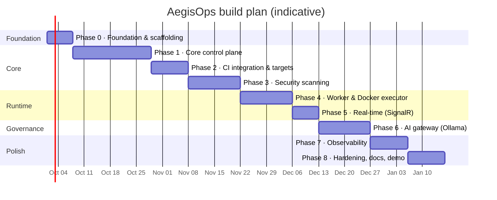

# 19 — Roadmap

Build order follows the agreed sequence: **core control plane → CI integration → security
scanning → worker & Docker execution → real-time → AI gateway → observability → hardening**.
Every phase ends with something demonstrable. Durations assume a solo developer working
part-time (~10–15 h/week); adjust freely — the *order* matters more than the dates.

## Phase 0 — Foundation & scaffolding (≈ 1 week)

**Goal:** an empty but fully wired repository where every later phase only adds features.

| Deliverable | Detail |
| --- | --- |
| Repository | `git init`, `.gitignore`, `LICENSE` (MIT), `README.md` (already drafted), `docs/` (this set) |
| Solution | `AegisOps.slnx` (SDK .NET 10 default) with Domain / Application / Infrastructure / Api / Worker + 5 test projects; `Directory.Build.props`, `Directory.Packages.props`, `.editorconfig` |
| Architecture tests | Dependency rule tests pass on the empty skeleton |
| Frontend | Vite + React + TS + Tailwind scaffold, ESLint/Prettier, AppShell with sidebar, `/login` placeholder |
| Compose | `postgres`, `redis`, `api`, `worker`, `web` services build and start; `/health` green |
| CI | `ci.yml` running backend build/test, frontend lint/build, Gitleaks/Semgrep/Trivy (SARIF) |
| Tooling | `scripts/dev-up.sh`, `gen-secrets.sh`, `.env.example`, Dependabot |

**Done when:** `docker compose up -d` shows the shell UI at `:3000` and the API's `/health/ready` is healthy; CI is green on `main`.

## Phase 1 — Core control plane (≈ 3 weeks)

**Goal:** the complete deployment decision loop works end-to-end with a simulated
executor — this is the MVP and the heart of the portfolio story.

| Area | Deliverable |
| --- | --- |
| Identity | ASP.NET Core Identity + JWT + refresh rotation; roles; seeded demo users; `/auth/*`; permissions matrix; `ApiKey` entity + auth handler |
| Organization | Teams, members, projects (auto Dev/Staging/Prod), environments (`noop` target), repositories; team scoping |
| Artifacts | Register artifact (manual via UI and via API key); list/detail; test summary |
| Policies | `Policy`/`PolicyRule`/`PolicyEvaluation`; **PolicyEngine** with rules `RequireTestsPassed`, `RequireApprovals`, `AllowedBranches`, `RequirePriorEnvironment`, `RequireImageDigest`, `DeploymentWindow` (`MaxFindings`/`RequireScan` land in Phase 3 but the engine is complete); rule-type catalogue endpoint; simulate endpoint |
| Deployments | Request → in-process job loop (Worker project runs the same `JobDispatcherService`) → evaluate → `Denied` / `AwaitingApproval` / `Approved` → `NoopDeploymentExecutor` → `Succeeded`; approvals with separation of duties; cancel; timeline events |
| Jobs | PostgreSQL job table, claim with `SKIP LOCKED`, retry/backoff, reaper |
| Audit | `IAuditWriter`, audit endpoints, coverage for all Phase-1 actions |
| Frontend | Login, dashboard (basic counts), projects list/detail, artifact list/detail with "Deploy", deployments list/detail with **PolicyEvaluationPanel** and **ApprovalPanel**, approvals queue, policies list + **RuleBuilder**, audit log, admin users/teams (polling refresh every 10 s; SignalR comes in Phase 5) |
| Tests | Policy engine matrix (cases not needing scans), state machine tests, integration flow tests, authorization matrix |
| Docs | Update ADR statuses to Accepted where implemented |

**Done when:** Journey A (with simulated deploy) and Journey D run entirely from the UI with seeded data; the policy test matrix passes; audit log shows every step.

## Phase 2 — CI integration & target applications (≈ 1.5 weeks)

**Goal:** real repositories feed AegisOps.

| Deliverable | Detail |
| --- | --- |
| `aegisops-service-template` | Minimal API, Dockerfile, tests, `ci.yml` |
| Three target repos | `site-service`, `circuit-service`, `notification-service` generated from template, pushing images to GHCR |
| Composite action | `.github/actions/aegisops-report` (register artifact, upload scans, request deployment) |
| Connectivity | Self-hosted runner on the dev machine **or** tunnel; `ci-replay.sh` offline fallback with saved payloads in `tests/fixtures/ci-payloads/` |
| API keys UI | Create/revoke in project settings; `LastUsedAt` |
| Idempotency | Redis idempotency store + filter |

**Done when:** a push to `circuit-service/main` results in a new artifact and a Staging deployment request in AegisOps without manual steps.

## Phase 3 — Security scanning (≈ 2 weeks)

**Goal:** scanner findings become policy inputs.

| Deliverable | Detail |
| --- | --- |
| Ingestion | `POST /artifacts/{id}/scans` (multipart), report storage, `SarifReportParser` + enrichers, async parse job for large reports |
| Findings | Entities, summaries, fingerprinting, suppressions (by fingerprint per project), findings explorer UI, finding detail |
| Policy | `RequireScan`, `MaxFindings` rules; seeded Staging/Production gates; test matrix cases 4–7, 13–14, 27–29, 32 |
| CI | Gitleaks/Semgrep/Trivy steps in the template and target repos; `demo/vulnerable` branches |
| Dogfooding | AegisOps CI fails on Critical findings |

**Done when:** Journey B (vulnerable build denied with explanation) is reproducible from a push to `demo/vulnerable`.

## Phase 4 — Worker & Docker executor (≈ 2 weeks)

**Goal:** deployments actually run containers.

| Deliverable | Detail |
| --- | --- |
| `DockerDeploymentExecutor` | Pull by digest, replace container, health check, auto-rollback, labels; registry auth for GHCR |
| Environment targets | `Target` editor in UI with validation; `GET /environments/{id}/runtime` |
| Compose | `docker-compose.targets.yml` networks; Worker socket mount with `group_add`; docker-socket-proxy option documented |
| Rollback endpoint | `POST /deployments/{id}/rollback` |
| Worker ops | Dead-letter list + retry (Admin), queue depth metric, graceful shutdown |
| Optional | `RunSecurityScan` job running scanner containers (`Worker:RunScans`) |

**Done when:** a Staging deployment replaces the running `circuit-service-staging` container and `GET :8102/version` returns the new version; a forced health failure rolls back.

## Phase 5 — Real-time (≈ 1 week)

**Goal:** no polling.

| Deliverable | Detail |
| --- | --- |
| Hub | `OpsHub`, groups, authorization on join; Redis pub/sub bridge Worker → Api |
| Frontend | Connection lifecycle, invalidation map, live timeline, approval toasts, connection status indicator, polling fallback |
| Notifications | `SendNotification` job; team outbound webhook with HMAC |
| Tests | Hub authorization; invalidation hook |

**Done when:** two browser sessions see the same deployment timeline update live; an approver gets a toast within a second of `AwaitingApproval`.

## Phase 6 — AI gateway (≈ 2 weeks)

**Goal:** governed AI usage, demonstrable in numbers.

| Deliverable | Detail |
| --- | --- |
| Models & policies | `AiModel`, `AiPolicy` (Global + Team), sync from Ollama, editors |
| Gateway pipeline | Authorize → policy → rate limit (Redis Lua) → validation → sensitive-data detection (Redact/Block) → Ollama → audit |
| Detectors | Regex set with tests, incl. Malaysian NRIC/phone, private IPs |
| Endpoints | `/ai/chat`, `/ai/models`, `/ai/requests`; deployment AI summary; finding AI explain |
| Frontend | Chat playground with **GovernancePanel**, AI request log, AI policies editor, "Summarize for approvers" button |
| Compose | `ollama` + `ollama-init` profile; hardware notes in README |
| Tests | Detector suite; gateway integration tests with fake `ILlmClient`; rate-limit 429 |

**Done when:** Journey C runs; the AI request log shows blocked/redacted entries; approvers can read an AI summary on a production deployment.

## Phase 7 — Observability (≈ 1.5 weeks)

| Deliverable | Detail |
| --- | --- |
| Metrics | Custom `Meter("AegisOps")` metrics from [15 §2](15-observability.md#2-metrics-opentelemetry--prometheus); `/metrics` on Api and Worker |
| Tracing | `ActivitySource`, job link to originating request, Ollama spans |
| Compose | `prometheus`, `grafana` profile with provisioned dashboards and rules |
| Health | Readiness with degraded states; UI banner when Ollama/Docker unavailable |
| Logging | Serilog JSON, enrichers, PII policy |

**Done when:** the three provisioned dashboards show live data during a demo run.

## Phase 8 — Hardening, documentation, demo (≈ 1.5 weeks)

| Deliverable | Detail |
| --- | --- |
| Security | Checklist in [17](17-security-hardening.md) §3 verified; authorization matrix tests complete; rate limits tuned; CSP; audit coverage test |
| Data | Content retention job; report cleanup; job cleanup |
| Demo | `reset-demo.sh`; scripted demo (`docs/demo-script.md`, to be written in this phase); 60-second GIF for README; screenshots |
| Docs | README final; ADR statuses; `CHANGELOG.md`; "Interview notes" section summarising design trade-offs |
| Release | Tag `v1.0.0`; images on GHCR |

**Done when:** a stranger can clone, run `docker compose up -d`, follow the demo script and reproduce all four journeys in under 15 minutes.

## V2 backlog (not scheduled)

| Item | Motivation |
| --- | --- |
| Streaming AI responses (SSE) | UX |
| OIDC login (GitHub / Keycloak) | Enterprise realism |
| `RequireSignedImage` (cosign) + SBOM ingestion | Supply-chain story |
| Kubernetes executor | Second `IDeploymentExecutor` proves the abstraction |
| Audit hash chain / export to WORM storage | Integrity |
| Slack/email notifications | Convenience |
| Playwright E2E for journeys | Regression safety |
| Polyglot target (Node.js `notification-service`) | Scanner language coverage |
| Message broker (RabbitMQ/MassTransit) | Only if job fan-out becomes real |
| Multi-tenant organisations | Only if the product story needs it |

## Risk register

| Risk | Impact | Mitigation |
| --- | --- | --- |
| Scope creep (adding K8s/Kafka early) | Core never finishes | Exclusion list in [03 §6](03-tech-stack.md#6-explicitly-excluded-for-v1); phases gate features |
| GitHub-hosted runners cannot reach a laptop | Phase 2 blocked | Self-hosted runner or tunnel; offline replay script |
| Laptop too weak for LLM | Phase 6 demo weak | 3B model default; AI features degrade gracefully when Ollama is down |
| Docker socket security concerns in interviews | Credibility | Documented threat model + socket-proxy option; clear "single trusted host" statement |
| Time-zone bugs in `DeploymentWindow` | Wrong denials | `TimeProvider` + explicit IANA zone + boundary tests (matrix 20–24) |
| SARIF variations between scanner versions | Parser breaks | Fixture-based tests per scanner version; enrichers isolated; pinned scanner majors |
| EF migration noise for JSON/array columns | Bad migrations | Review every migration; idempotent script in PR |
